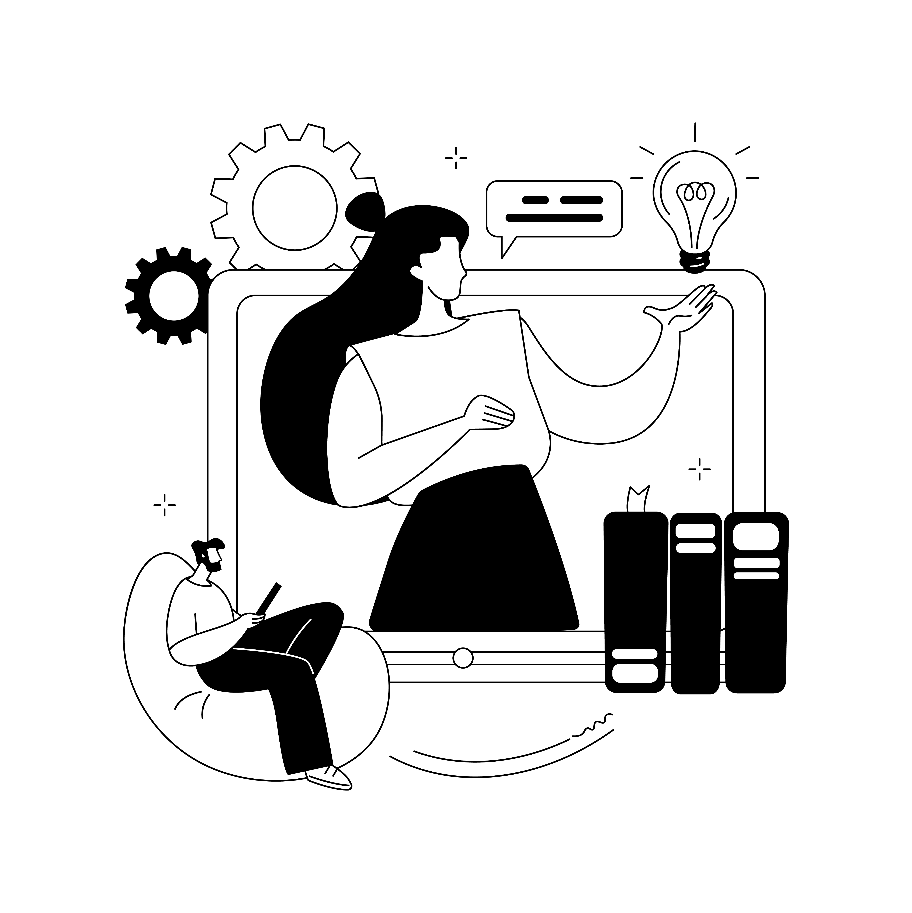

## Why Most Company Wikis Fail (And How to Build One That Actually Works)

Meet Tom, a CEO who spent months building what he thought was the perfect company wiki. Detailed processes, comprehensive guides, everything organized in neat folders. Six months later? His team still asks the same questions in Slack, and the wiki sits unused, gathering digital dust.

Sound familiar? Here's the uncomfortable truth: most company knowledge bases fail not because they lack information, but because they're built like libraries when they should work like helpful colleagues.

## The Real Problem with Traditional Company Wikis

Traditional knowledge bases suffer from three fatal flaws:

**The Search Problem**: Finding the right information takes longer than just asking someone
**The Update Problem**: Information becomes outdated faster than it can be maintained  
**The Usage Problem**: People don't know what they don't know, so they never search for it

But what if your company wiki could think, understand context, and proactively help your team? That's exactly what AI-powered knowledge bases do.

## The AI Revolution in Company Knowledge

Instead of static documents, imagine a knowledge base that:

- **Understands questions** in natural language, not just keywords
- **Provides contextual answers** based on who's asking and what they're working on
- **Learns and improves** from every interaction
- **Proactively suggests** relevant information when team members need it

This isn't theoretical—companies are building these systems right now using ChatGPT and other AI tools.

## Building Your AI-Powered Knowledge Base: The Smart Way

### Phase 1: Start with Your Team's Actual Questions

Don't begin by documenting everything. Start by tracking what people actually ask about:

- Review your Slack channels for recurring questions
- Look at support tickets and internal help requests
- Ask team members: "What do you wish you could instantly know?"

**Pro tip**: Use ChatGPT to analyze your Slack exports and identify the most common question patterns. It's like having a research assistant that never gets tired.

### Phase 2: Create Living Documents with AI

Instead of writing static procedures, create dynamic content:

**Traditional SOP**: "To process a refund, go to the admin panel, click customers, find the order..."

**AI-Enhanced SOP**: A conversational guide that asks clarifying questions: "What type of refund are you processing? Let me walk you through the exact steps for your situation..."

Use ChatGPT to help transform your existing procedures into conversational, context-aware guides.

### Phase 3: Make It Searchable and Smart

The magic happens when your knowledge base can understand intent, not just match keywords:

- **Question**: "How do I handle an angry customer?"
- **Traditional search**: Returns 47 documents about customer service
- **AI search**: Provides specific de-escalation steps, relevant examples, and connects you with the right team member

## Real Success Story: How Lisa Transformed Her Agency

Lisa runs a digital marketing agency with 25 employees. Her old knowledge base was a mess of outdated Google Docs that nobody used. Here's how she built an AI-powered system that her team actually loves:

### Week 1: Question Mining
She used ChatGPT to analyze 6 months of internal Slack messages and identified the top 50 questions her team asked repeatedly.

### Week 2: Smart Content Creation
Instead of writing traditional documents, she created conversational guides for each topic using AI assistance. Each guide could handle variations of the same question.

### Week 3: Implementation
She set up a simple AI-powered search system that could understand natural language queries and provide contextual answers.

### The Results:
- **90% reduction** in repeated questions in Slack
- **75% faster** onboarding for new team members
- **60% improvement** in process consistency
- **Zero maintenance headaches**—the system learns and updates itself

## The ChatGPT Method for Building SOPs

Here's the exact process Lisa used to transform her procedures:

### Step 1: Feed ChatGPT Your Existing Process
"Here's how we currently handle client onboarding. Help me turn this into a conversational guide that can handle different scenarios."

### Step 2: Create Decision Trees
Instead of linear instructions, build branching paths: "If the client is enterprise-level, follow path A. If they're a startup, follow path B."

### Step 3: Add Context and Examples
"For each step, provide a real example and explain why we do it this way."

### Step 4: Build in Learning
"What questions might someone have at each step? How should we handle edge cases?"

## Why This Matters More Than Ever

Remote and hybrid work has made company knowledge even more critical. When your team can't tap someone on the shoulder for a quick question, your knowledge base becomes the difference between productivity and frustration.

Companies with effective knowledge management see:
- **40% faster** employee onboarding
- **50% reduction** in repeated questions
- **30% improvement** in process consistency
- **25% increase** in employee satisfaction

## Building Your AI Knowledge Base: Getting Started

### Week 1: Audit and Analyze
- Export your Slack/Teams conversations
- Use ChatGPT to identify common question patterns
- List your top 20 most-asked questions

### Week 2: Create Smart Content
- Transform your top 10 processes into conversational guides
- Use AI to create multiple versions for different scenarios
- Add context, examples, and decision points

### Week 3: Implement and Test
- Set up a simple search system (even a well-organized ChatGPT custom GPT works)
- Train your team on how to use it
- Gather feedback and iterate

### Week 4: Scale and Improve
- Add more content based on usage patterns
- Implement feedback loops for continuous improvement
- Connect it to your other tools and workflows

## The Future is Conversational Knowledge

The companies that thrive in the next decade will be those that can capture, organize, and share knowledge effectively. But "effectively" doesn't mean perfectly organized—it means instantly accessible and contextually relevant.

Your knowledge base should feel less like a library and more like having the smartest, most helpful colleague always available to answer questions.

## Ready to Build Knowledge That Actually Gets Used?

Stop building knowledge bases that collect dust. Start building AI-powered systems that your team will actually love using. The technology is here, the tools are accessible, and the competitive advantage is enormous.

The question isn't whether AI will transform how companies manage knowledge—it's whether you'll lead that transformation or get left behind.

---

*Want to see this in action? Learn how to use your AI-powered knowledge base to [create intelligent communication workflows](/blog/ai-workflow-communication) and discover how it makes [new team member onboarding](/blog/team-onboarding-automation) incredibly smooth.*
