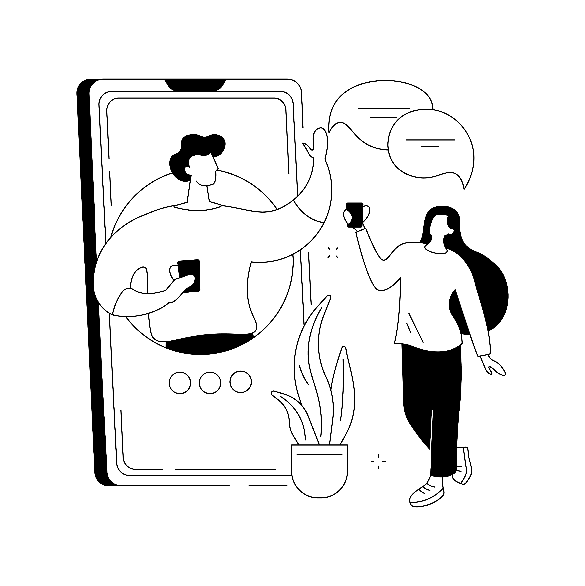

## The Future of Customer Communication is Here

Imagine a world where every customer inquiry gets an instant, accurate response—whether it comes through your chatbot, email, or contact form. No more delayed responses, no more inconsistent information, and no more overwhelmed support teams trying to keep up with growing demand.

This isn't science fiction. It's happening right now with AI-powered communication workflows, and we're going to show you exactly how to build one for your business.

## The Problem Most Businesses Face

Sarah runs a growing software company. Every day, her team receives dozens of questions about pricing, features, technical issues, and account management. Her support team spends hours crafting responses, often repeating the same information over and over.

Sound familiar? Here's what typically happens:

- **Delayed responses** during busy periods or after hours
- **Inconsistent information** when different team members answer similar questions
- **Overwhelmed staff** spending time on repetitive inquiries instead of complex issues
- **Missed opportunities** when potential customers don't get quick answers

## The AI-Powered Solution

What if every customer question could be automatically processed against your company's knowledge base and SOPs, then generate a personalized, accurate response in seconds? That's exactly what we built for Sarah's company using AI and n8n automation.

Here's how the magic happens:

### Step 1: The Inquiry Arrives
Whether someone asks a question in your chatbot, sends an email, or fills out a contact form, the message gets captured and sent to your n8n workflow.

### Step 2: AI Processing
The workflow sends the customer's question to an AI system (like OpenAI's GPT) along with relevant context from your knowledge base. The AI understands the question and crafts an appropriate response based on your company's specific information.

### Step 3: Smart Response
The AI-generated response gets sent back to the customer through their preferred channel—all within seconds of their original inquiry.

### Step 4: Human Oversight
For complex issues, the system can flag responses for human review or automatically escalate to your support team.

## Real-World Example: Sarah's Success Story

After implementing this system, Sarah's company saw incredible results:

- **Response time**: From 4-6 hours to under 30 seconds
- **Customer satisfaction**: Increased by 45% due to instant, accurate responses
- **Team productivity**: Support staff now focus on complex issues and relationship building
- **24/7 availability**: Customers get help even outside business hours

One customer wrote: *"I was amazed to get such a detailed, helpful response at 11 PM on a Sunday. It felt like talking to your best support person, but instantly!"*

## Building Your AI Communication Workflow

### What You'll Need:
- **n8n** (the automation platform that connects everything)
- **AI service** (OpenAI, Anthropic, or similar)
- **Knowledge base** (your company's information organized and accessible)
- **Communication channels** (website chat, email, contact forms)

### The Basic Workflow:
1. **Trigger**: New message received from any channel
2. **Process**: Extract and clean the customer's question
3. **Enhance**: Add relevant context from your knowledge base
4. **Generate**: Send to AI with specific instructions for tone and format
5. **Deliver**: Send response back through the original channel
6. **Learn**: Log the interaction to improve future responses

## Getting Started: Your First AI Communication Bot

Start simple with these steps:

**Week 1**: Identify your most common customer questions and organize your knowledge base
**Week 2**: Set up basic n8n workflow connecting your contact form to AI
**Week 3**: Test and refine responses, add more communication channels
**Week 4**: Implement human oversight and escalation rules

## The Business Impact

Companies using AI-powered communication workflows typically see:

- **80% reduction** in response time
- **60% decrease** in support ticket volume
- **40% improvement** in customer satisfaction scores
- **50% more time** for strategic customer relationship work

## Beyond Basic Q&A

Once your foundation is solid, you can expand to:

- **Personalized recommendations** based on customer history
- **Proactive outreach** when customers might need help
- **Multi-language support** for global customers
- **Sentiment analysis** to prioritize urgent or frustrated customers

## Ready to Transform Your Communication?

The technology exists today to give every customer an amazing experience, regardless of when they reach out or how busy your team is. The question isn't whether AI communication workflows work—it's whether you'll implement them before your competitors do.

Your customers expect instant, helpful responses. With AI-powered workflows, you can exceed those expectations while freeing your team to focus on what humans do best: building relationships and solving complex problems.

Want to see how this could work for your specific business? We'd love to show you a custom demo and help you build your first AI communication workflow.

---

*Ready to dive deeper? Check out our guide on [building a comprehensive knowledge base](/blog/ai-knowledge-base-sops) to power your AI communications, and learn about [streamlining team onboarding](/blog/team-onboarding-automation) with similar automation techniques.*
